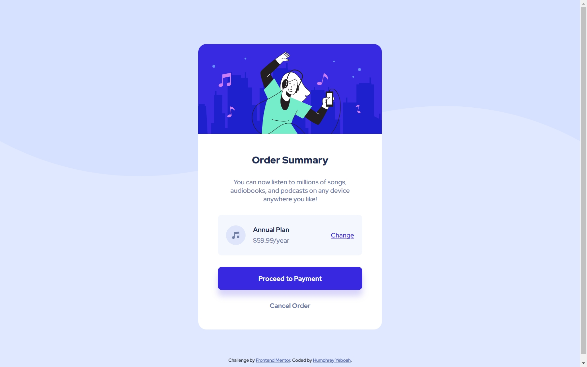

<!-- @format -->

# Frontend Mentor - Order summary card solution

This is a solution to the [Order summary card challenge on Frontend Mentor](https://www.frontendmentor.io/challenges/order-summary-component-QlPmajDUj). Frontend Mentor challenges help you improve your coding skills by building realistic projects.

## Table of contents

- [Overview](#overview)
  - [The challenge](#the-challenge)
  - [Screenshot](#screenshot)
  - [Links](#links)
- [My process](#my-process)
  - [Built with](#built-with)
  - [What I learned](#what-i-learned)
  - [Useful resources](#useful-resources)
- [Author](#author)

## Overview

### The challenge

Users should be able to:

- See hover states for interactive elements

### Screenshot



### Links

- Solution URL: [Github repo](https://your-solution-url.com)
- Live Site URL: [Live site link](https://your-live-site-url.com)

## My process

### Built with

- Semantic HTML5 markup
- CSS(BEM)
- Flexbox

### What I learned

I learnt how to add a box-shadow to my work.

```css
/* right bottom blur color */
.btn--pay {
	box-shadow: 0 15px 15px rgba(56, 41, 224, 0.2);
}
```

### Useful resources

- [Css box Shadow](https://www.w3schools.com/csS/css3_shadows_box.asp) - This helped me implement a slight shadow on the button.
- [Controlling background-images](https://youtu.be/3T_Jy1CqH9k) - This helped me to soidify my understanding of background images.

## Author

- Website - [Humphrey Yeboah](https://www.humphreyyeboah.com)
- Frontend Mentor - [@hakylepremier](https://www.frontendmentor.io/profile/hakylepremier)
- Twitter(X) - [@hakylepremier](https://www.twitter.com/hakylepremier)
